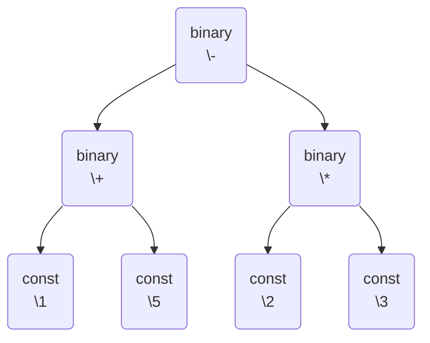

```mermaid
flowchart TB
    id0("binary
\-")
    id0 --> id1("binary
\+")
    id1 --> id2("const
\1")
    id1 --> id3("const
\5")
    id0 --> id4("binary
\*")
    id4 --> id5("const
\2")
    id4 --> id6("const
\3")
```