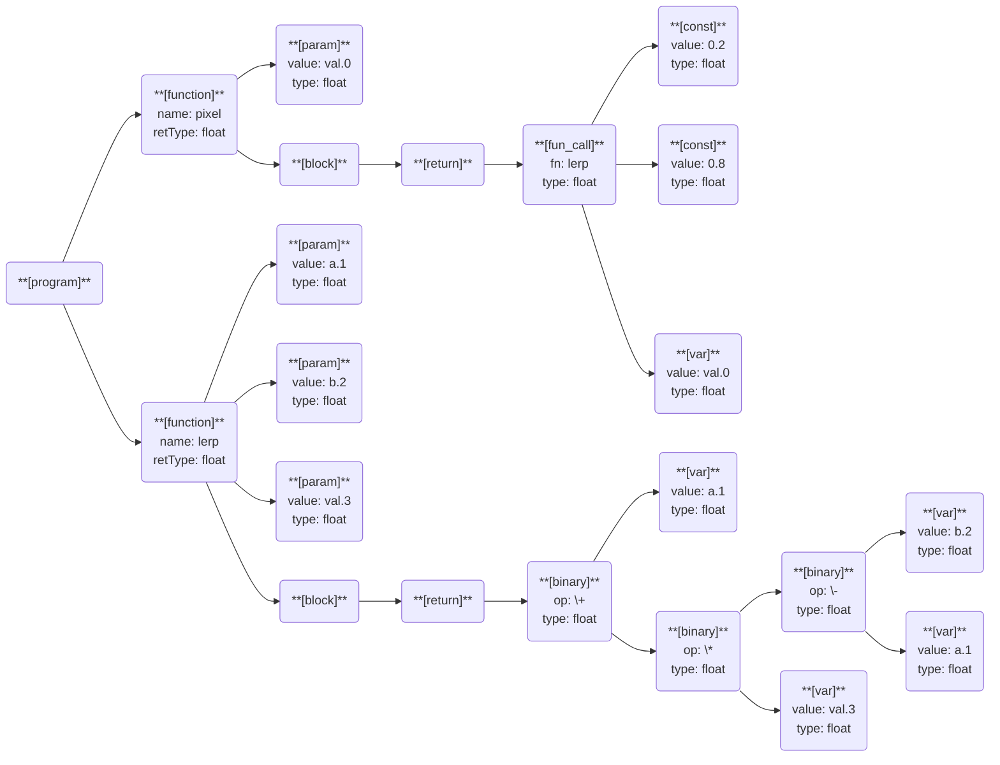

```mermaid
flowchart LR
id0("**[program]**")
id1("**[function]**
name: pixel
retType: float")
id2("**[param]**
value: val.0
type: float")
id1 --> id2
id3("**[block]**")
id4("**[return]**")
id5("**[fun_call]**
fn: lerp
type: float")
id6("**[const]**
value: 0.2
type: float")
id5 --> id6
id7("**[const]**
value: 0.8
type: float")
id5 --> id7
id8("**[var]**
value: val.0
type: float")
id5 --> id8
id4 --> id5
id3 --> id4
id1 --> id3
id0 --> id1
id9("**[function]**
name: lerp
retType: float")
id10("**[param]**
value: a.1
type: float")
id9 --> id10
id11("**[param]**
value: b.2
type: float")
id9 --> id11
id12("**[param]**
value: val.3
type: float")
id9 --> id12
id13("**[block]**")
id14("**[return]**")
id15("**[binary]**
op: \+
type: float")
id16("**[var]**
value: a.1
type: float")
id15 --> id16
id17("**[binary]**
op: \*
type: float")
id18("**[binary]**
op: \-
type: float")
id19("**[var]**
value: b.2
type: float")
id18 --> id19
id20("**[var]**
value: a.1
type: float")
id18 --> id20
id17 --> id18
id21("**[var]**
value: val.3
type: float")
id17 --> id21
id15 --> id17
id14 --> id15
id13 --> id14
id9 --> id13
id0 --> id9
```