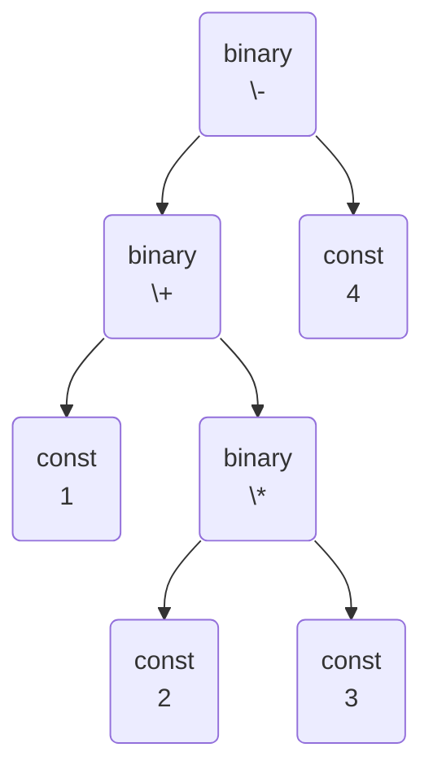

```mermaid
flowchart TB
    id0("binary
\-")
    id0 --> id1("binary
\+")
    id1 --> id2("const
1")
    id1 --> id3("binary
\*")
    id3 --> id4("const
2")
    id3 --> id5("const
3")
    id0 --> id6("const
4")
```