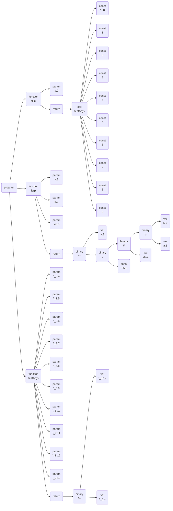

```mermaid
flowchart LR
id0("program")
id0 --> id1("function
pixel")
id1 --> id2("param
a.0")
id1 --> id3("return")
id3 --> id4("call
testArgs")
id4 --> id5("const
100")
id4 --> id6("const
1")
id4 --> id7("const
2")
id4 --> id8("const
3")
id4 --> id9("const
4")
id4 --> id10("const
5")
id4 --> id11("const
6")
id4 --> id12("const
7")
id4 --> id13("const
8")
id4 --> id14("const
9")
id0 --> id15("function
lerp")
id15 --> id16("param
a.1")
id15 --> id17("param
b.2")
id15 --> id18("param
val.3")
id15 --> id19("return")
id19 --> id20("binary
\+")
id20 --> id21("var
a.1")
id20 --> id22("binary
\/")
id22 --> id23("binary
\*")
id23 --> id24("binary
\-")
id24 --> id25("var
b.2")
id24 --> id26("var
a.1")
id23 --> id27("var
val.3")
id22 --> id28("const
255")
id0 --> id29("function
testArgs")
id29 --> id30("param
\_0.4")
id29 --> id31("param
\_1.5")
id29 --> id32("param
\_2.6")
id29 --> id33("param
\_3.7")
id29 --> id34("param
\_4.8")
id29 --> id35("param
\_5.9")
id29 --> id36("param
\_6.10")
id29 --> id37("param
\_7.11")
id29 --> id38("param
\_8.12")
id29 --> id39("param
\_9.13")
id29 --> id40("return")
id40 --> id41("binary
\+")
id41 --> id42("var
\_8.12")
id41 --> id43("var
\_0.4")
```