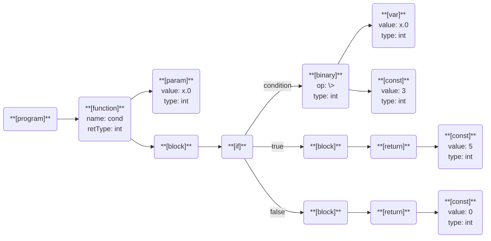

```mermaid
flowchart LR
id0("**[program]**")
id1("**[function]**
name: cond
retType: int")
id2("**[param]**
value: x.0
type: int")
id1 --> id2
id3("**[block]**")
id4("**[if]**")
id5("**[binary]**
op: \>
type: int")
id6("**[var]**
value: x.0
type: int")
id5 --> id6
id7("**[const]**
value: 3
type: int")
id5 --> id7
id4 -->|condition| id5
id8("**[block]**")
id9("**[return]**")
id10("**[const]**
value: 5
type: int")
id9 --> id10
id8 --> id9
id4 -->|true| id8
id11("**[block]**")
id12("**[return]**")
id13("**[const]**
value: 0
type: int")
id12 --> id13
id11 --> id12
id4 -->|false| id11
id3 --> id4
id1 --> id3
id0 --> id1
```